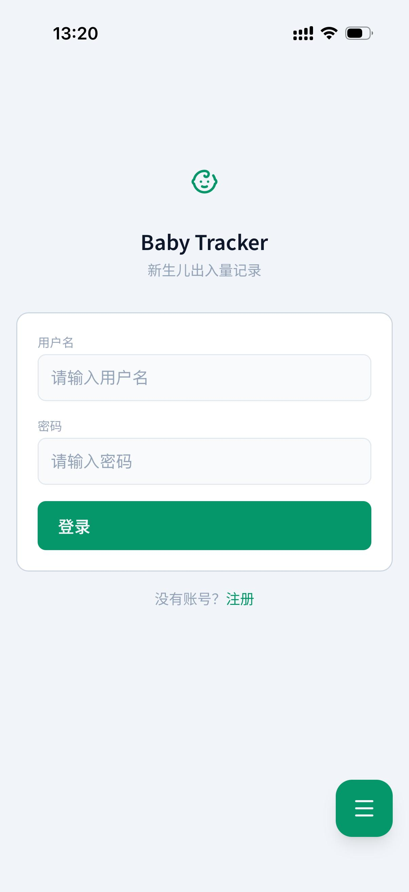
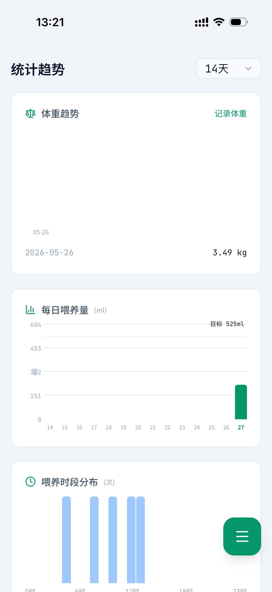
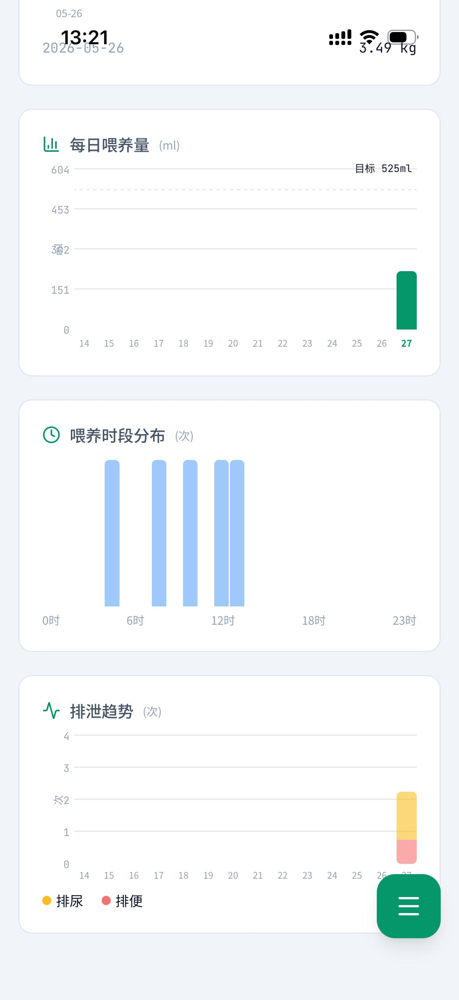
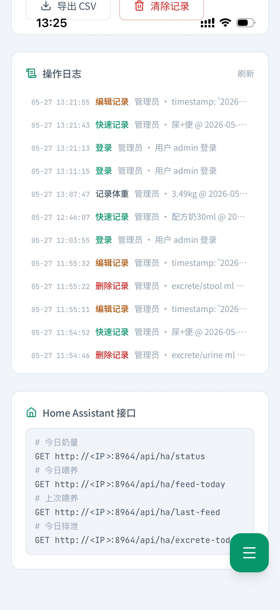

<p align="center">
  
  
  
</p>

<h1 align="center">Baby Tracker</h1>

<p align="center">
  <strong>新生儿出入量记录 · 喂养 / 排泄 / 体重一站式追踪</strong>
  <br>
  一款专为新手父母设计的婴儿日常数据记录与分析工具
</p>

---

## 截图预览

| 登录 | 仪表盘 |
|:---:|:---:|
|  |  |

| 统计趋势（上） | 统计趋势（下） |
|:---:|:---:|
|  |  |

| 历史记录 | 管理后台 |
|:---:|:---:|
|  |  |

---

## 功能特性

### 今日概览仪表盘
- **奶量环形图** — 直观展示当日已完成 vs 目标喂养量（如 220 / 525 ml）
- **喂养进度条** — 已喂次数 / 目标次数，一目了然
- **剩余次数 & 排泄统计** — 排尿、排便独立计数
- **上次喂养时间** — 精准到分钟，方便控间隔
- **快捷记录按钮** — 配方奶、母乳、排便、排尿一键录入

### 统计趋势分析
- **体重趋势** — 折线图追踪宝宝体重变化，支持 14 天周期切换
- **每日喂养量** — 柱状图对比每日实际喂养量与目标线
- **喂养时段分布** — 按小时聚合的条形图，掌握昼夜喂养规律
- **排泄趋势** — 堆叠柱状图（排尿 + 排便），发现异常及时预警

### 历史记录
- **日历视图** — 点击任意日期回溯当天所有记录
- **分类筛选** — 全部 / 喂养 / 排泄 / 症状，快速定位
- **单条操作** — 每条记录支持编辑与删除，带精确时间戳

### 数据管理
- **CSV 导出** — 一键导出全部记录，支持 Excel 打开
- **清除记录** — 批量清理历史数据
- **操作日志** — 管理员可查看完整操作审计轨迹

### Home Assistant 集成
- **REST API** — 提供标准化 GET 接口，可将喂养数据接入 Home Assistant
- 在 HA 仪表盘中实时展示宝宝喂奶、排泄等关键指标
- 结合自动化场景（如定时提醒喂奶）

---

## 快速开始

本项目仅提供 Docker 部署方式，其他平台未打包和测试。

### 前置要求

| 依赖 | 版本 |
|------|------|
| Docker | 20.10+ |
| Docker Compose | 2.0+ |

### 部署

```bash
# 克隆仓库
git clone https://github.com/your-org/baby-tracker.git
cd baby-tracker

# 一键启动
docker compose up -d
```

服务默认映射到宿主机 **8964** 端口，访问 `http://localhost:8964` 即可使用。数据持久化在 `./data` 目录。

### docker-compose.yml

```yaml
version: '3.8'
services:
  baby-tracker:
    build: .
    ports:
      - "8964:5000"
    volumes:
      - ./data:/app/data
    environment:
      - FLASK_ENV=production
      - TZ=Asia/Shanghai
    restart: unless-stopped
```

---

## Home Assistant 配置

在 `configuration.yaml` 中添加 REST 传感器，将 `<your-server>` 替换为 Docker 宿主机的 IP（如 `192.168.1.100:8964`）：

```yaml
sensor:
  - platform: rest
    name: "宝宝今日奶量"
    resource: "http://<your-server>:8964/api/baby/daily/milk"
    value_template: "{{ value_json.total_ml }}"
    unit_of_measurement: "ml"
    scan_interval: 300

  - platform: rest
    name: "宝宝今日排便"
    resource: "http://<your-server>:8964/api/baby/daily/diaper"
    value_template: "{{ value_json.count }}"
    unit_of_measurement: "次"
    scan_interval: 300
```

---

## Docker 构建

如需构建自定义镜像，项目根目录已包含 `Dockerfile`：

```dockerfile
FROM python:3.11-slim

WORKDIR /app

COPY requirements.txt .
RUN pip install --no-cache-dir -r requirements.txt

COPY . .

EXPOSE 5000

CMD ["python", "app.py"]
```

---

## 项目结构

```
baby-tracker/
├── app.py                  # Flask 主程序
├── requirements.txt        # Python 依赖
├── Dockerfile              # Docker 镜像构建
├── docker-compose.yml      # Docker Compose 编排
├── data/                   # 持久化数据（SQLite）
├── screenshots/            # 应用截图
├── static/                 # 前端静态资源
├── templates/              # Jinja2 模板
└── README.md
```

---

## 路线图

- [x] 喂养 / 排泄记录
- [x] 体重追踪
- [x] 统计趋势可视化
- [x] Home Assistant 集成
- [x] CSV 导出
- [ ] 疫苗接种提醒
- [ ] 生长曲线百分位对照（WHO 标准）
- [ ] 多宝宝切换
- [ ] 家庭成员共享

---

## 许可

MIT License © 2026
