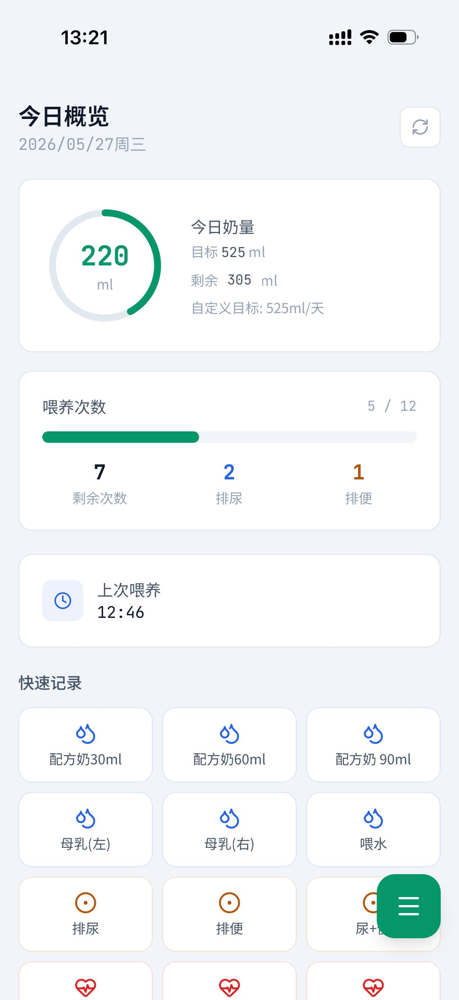
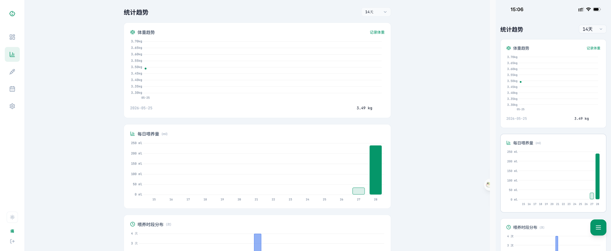
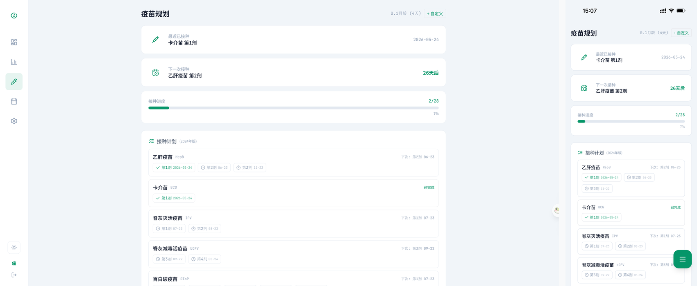
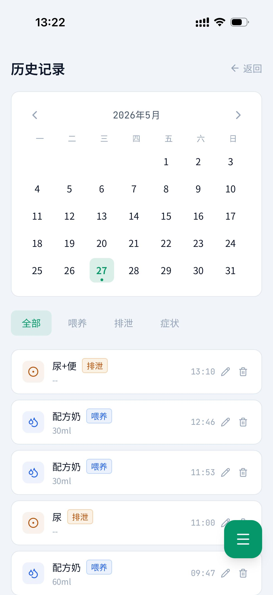

<div align="center">

# Baby Tracker

**新生儿出入量记录系统** — 全功能、轻量级、Docker 一键部署

[](https://hub.docker.com/)
[](https://www.python.org/)
[](https://flask.palletsprojects.com/)
[](LICENSE)

</div>

---

## 功能特性

### 仪表盘
- 今日喂养量/排泄次数/体重概览
- 一键快速记录（管理员自定义按钮）
- 奶量估算（支持自定义系数）
- 喂养次数动态计算

### 统计趋势
- **体重趋势** — 折线图，支持悬停查看详细数据
- **每日喂养量** — 柱状图，含目标线参考
- **喂养时段分布** — 24 小时柱状图
- **排泄趋势** — 堆叠柱状图（排尿 + 排便）
- 支持 7/14/30 天切换，Chart.js 驱动，触摸滑动友好
- 体重记录支持编辑/删除

### 疫苗规划
- 基于 2024 版国家免疫规划（含百白破 5 剂新规）
- 互斥疫苗逻辑（乙脑减毒/灭活二选一，甲肝减毒/灭活二选一）
- 接种进度概览 + 下次接种倒计时
- 未接种项目可修改计划日期
- 已接种记录可编辑日期/备注/删除
- 支持自定义疫苗

### 历史记录
- 月历视图，多色指示点：
  - 🟢 绿点 = 喂养记录
  - 🟡 黄点 = 已接种疫苗
  - 🔴 红点 = 未接种（计划中）
  - ⚫ 黑点 = 逾期未接种
- 筛选：全部 / 喂养 / 排泄 / 症状 / 疫苗
- 记录编辑/删除

### Home Assistant 集成
- REST 传感器同步喂养数据
- REST 开关实现远程快速记录
- 2 秒自动回弹

### 其他
- 🌗 亮色/暗色主题切换
- 📱 PWA 支持（添加到桌面）
- 🔒 用户认证 + 管理员审批
- 📝 操作日志
- 🐳 Docker 一键部署

---

## 界面预览

<div align="center">

### 仪表盘


### 统计趋势


### 疫苗规划


### 历史记录


</div>

---

### 首次使用

1. 默认管理/密码:admin/admin123
2. 管理员登录后在管理面板设置宝宝信息（出生日期、体重等）
3. 审批新用户
4. 开始记录！

---

## 配置

### docker-compose.yml

```yaml
version: '3.8'
services:
  baby-tracker:
    container_name: baby_tracker
    image: "ghcr.io/xigemax/baby_tracker:latest"
    ports:
      - "8964:5000"
    volumes:
      - ./data:/app/data
    environment:
      - FLASK_ENV=production
      - TZ=Asia/Shanghai
    restart: unless-stopped
```

### 数据持久化

数据存储在 `./data` 目录下的 SQLite 数据库，Docker 部署时自动挂载 volume。

---

## Home Assistant 集成

推荐使用管理面板内置「快速配置向导」

### 快速配置向导

| 步骤 | 操作 |
|------|------|
| 1. 生成 API 密钥 | 管理面板 → Home Assistant 集成 → 点击「生成」并复制 |
| 2. 填写服务地址 | 输入 Baby Tracker 的局域网 IP + 端口（默认 `8964`） |
| 3. 选择实体 | 勾选需要的传感器（只读）和开关（可远程记录） |
| 4. 生成配置代码 | 点击「生成配置代码」，复制粘贴到 HA 的 `configuration.yaml` |

重启 Home Assistant 或 reload YAML 配置即可生效。

### 手动配置

**传感器示例：**

```yaml
sensor:
  - platform: rest
    name: "宝宝今日奶量"
    resource: "http://<IP>:8964/api/ha/status"
    value_template: "{{ value_json.total_feed_ml }}"
    unit_of_measurement: "ml"
    json_attributes:
      - feed_count
      - target_ml
      - urine_count
      - stool_count
      - last_feed_time
    scan_interval: 300
```

**开关示例：**

```yaml
switch:
  - platform: rest
    name: "喂养-母乳30ml"
    resource: "http://<IP>:8964/api/ha/button/1?api_key=<YOUR_API_KEY>"
    body_on: '{"state":"on"}'
    body_off: '{"state":"off"}'
    is_on_template: "{{ value_json.state == 'on' }}"
    headers:
      Content-Type: application/json
    scan_interval: 5
```

### 仪表盘卡片

```yaml
type: entities
title: 宝宝喂养
entities:
  - sensor.bao_bao_jin_ri_nai_liang
  - switch.wei_yang_mu_ru30ml
```

---


## PWA 安装

### iOS
1. Safari 打开页面
2. 点击「分享」→「添加到主屏幕」
3. 无边框全出血图标，适配刘海/灵动岛

### Android
1. Chrome 打开页面
2. 点击菜单→「安装应用」
3. 独立窗口运行，支持离线缓存

---

## 运维管理

### 重置管理员密码

如果忘记管理员密码，可通过 CLI 命令重置，系统将自动生成随机密码：

**Docker 部署：**
```bash
docker exec baby_tracker flask reset-password
```

输出示例：
```
管理员 [admin] 密码已重置
新密码: aB3kX9mN2p
```

> ⚠️ 请在获取新密码后尽快登录并修改为安全密码。

### 数据备份与恢复

**备份**：管理面板 → 数据管理 → 「备份数据」按钮，下载完整 JSON 备份文件

**恢复**：管理面板 → 数据管理 → 「恢复备份」按钮，选择之前导出的 `.json` 文件

> ⚠️ 恢复备份将覆盖当前所有数据，操作前请先备份！

**手动备份**（直接复制数据库文件）：
```bash
docker cp baby_tracker:/app/data/baby.db ./baby_backup.db
```

---

## 技术栈

| 层 | 技术 |
|----|------|
| 后端 | Python Flask + SQLite (WAL) |
| 前端 | Vanilla JS + Tailwind CSS + Chart.js |
| 图标 | Lucide Icons |
| 部署 | Docker + Gunicorn (1 worker) |
| PWA | Service Worker + Web App Manifest |

---

## 项目结构

```
baby-tracker/
├── docker-compose.yml      # Docker Compose 配置
├── screenshots/            # 界面截图
│   ├── dashboard.png
│   ├── trends.png
│   ├── vaccine.png
│   └── history.png
└── README.md               # 本文件
```

---

## 许可证

MIT License

