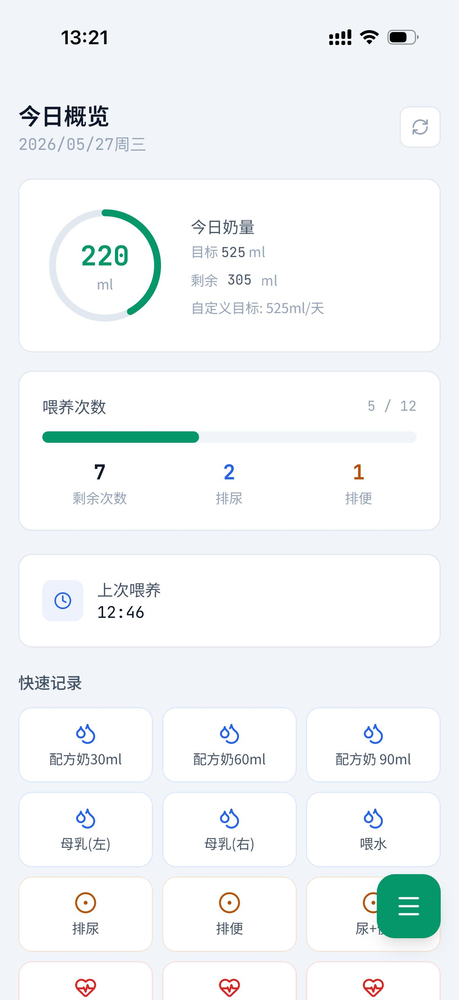
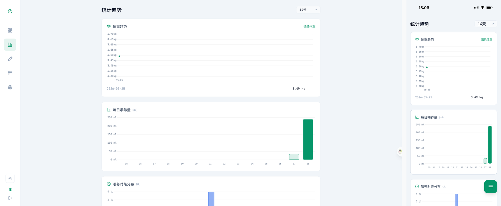
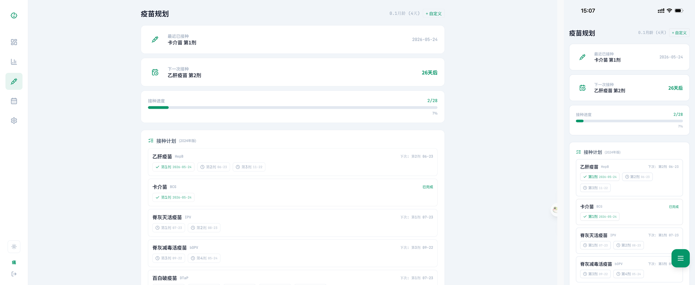
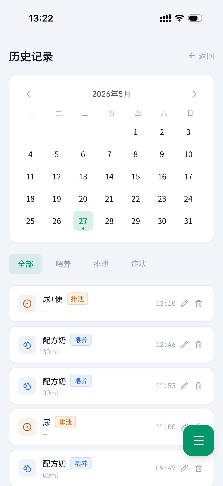

<div align="center">

# Baby Tracker

**新生儿与婴幼儿喂养、排泄和成长数据记录系统**

自托管部署，数据默认保存在本机 SQLite 数据库中，支持手机浏览器、PWA 和 Home Assistant。

[](https://www.python.org/)
[](https://flask.palletsprojects.com/)
[](https://github.com/XiGeMaX/Baby_tracker/pkgs/container/baby_tracker)
[](LICENSE)

</div>

## 项目简介

Baby Tracker 是一个面向家庭使用的轻量级婴儿记录应用，覆盖日常喂养、排泄、体重、疫苗、健康随访和倒数日等场景。后端使用 Flask，数据存储使用 SQLite，前端以服务端模板和原生 JavaScript 为主，可以通过 Docker 快速部署到 NAS、家用服务器或云主机。

首次启动会自动创建 SQLite 数据库和默认管理员账户，默认用户名为 `admin`，密码为 `admin123`。正式使用前请立即修改默认密码，并设置独立的 `SECRET_KEY`。

## 功能概览

### 总览仪表盘

- 展示今日奶量、目标奶量、剩余奶量、喂养次数和排泄次数。
- 根据宝宝出生日期、体重和自定义参数估算每日奶量及单次建议奶量。
- 显示最近一次喂养，按全部记录中的最新喂养时间计算，不受当前查询日期影响。
- 提供可排序、可启用的快捷记录按钮，支持喂养、排泄、症状、辅食等记录类型。
- 展示所选日期的记录明细，并支持新增、编辑和删除。

### 趋势分析

- 体重趋势和体重记录管理。
- 每日喂养量和目标参考线。
- 每日辅食摄入趋势。
- 排尿、排便趋势。
- 单日 24 小时喂养或排泄时段分布。
- 支持 7 天、14 天、30 天等统计范围，图表由 Chart.js 渲染。

### 成长与日程

- 基于 2024 版疫苗计划展示接种进度、剂次和计划日期。
- 支持记录接种日期、备注、自定义疫苗及互斥疫苗方案。
- 提供 0 至 6 岁儿童健康随访计划。
- 支持健康随访记录、自定义随访项目和倒数日。
- 通过日历和列表查看记录、计划和逾期状态。

### 管理与数据

- 用户注册、管理员审批、角色管理和密码管理。
- 宝宝资料、奶量目标、喂养次数和快捷按钮配置。
- 操作日志、数据统计、CSV 导出和 JSON 备份恢复。
- Home Assistant API 密钥管理、实体选择和配置生成向导。

### 使用体验

- 响应式布局，适合手机和桌面浏览器。
- 前端页面切换和移动端底部导航。
- 亮色、暗色主题。
- PWA 安装和 Service Worker 缓存。
- 登录会话有效期为 30 天。

## 界面预览

| 总览仪表盘 | 趋势分析 |
| --- | --- |
|  |  |

| 成长与日程 | 历史记录 |
| --- | --- |
|  |  |

## 快速开始

### Docker Compose 部署

仓库未内置 `docker-compose.yml`，请在部署目录中自行创建。下面的配置使用 GitHub Container Registry 中的镜像，并将数据保存到宿主机 `./data`：

```yaml
services:
  baby-tracker:
    container_name: baby_tracker
    image: ghcr.io/xigemax/baby_tracker:latest
    ports:
      - "8964:5000"
    volumes:
      - ./data:/app/data
    environment:
      TZ: Asia/Shanghai
      SECRET_KEY: "please-change-this-secret-key"
    restart: unless-stopped
```

启动服务：

```bash
docker compose up -d
```

更新镜像：

```bash
docker compose pull
docker compose up -d
```

启动后访问 `http://<服务器地址>:8964`。首次启动会创建 `data/baby.db` 和默认管理员账户。

### 本地开发

推荐使用 Python 3.11：

```bash
python3.11 -m venv .venv
source .venv/bin/activate
pip install -r requirements.txt

export SECRET_KEY="local-development-secret"
python app.py
```

开发服务器监听 `0.0.0.0:5000`，本机访问地址为 `http://127.0.0.1:5000`。`app.py` 在直接运行时启用 Flask 调试模式，不应直接用于生产环境。

### 运行测试

```bash
python -m unittest -v
```

测试使用临时数据库，不会修改正常运行时的 `data/baby.db`。

## 配置与数据

### 环境变量

| 变量 | 默认值 | 说明 |
| --- | --- | --- |
| `SECRET_KEY` | `baby-tracker-secret-key-change-in-prod` | Flask 会话签名密钥。生产环境必须设置随机且不可公开的值。 |
| `TZ` | Docker 镜像中为 `Asia/Shanghai` | 容器时区，影响记录时间和日期统计。 |
| `FLASK_APP` | Docker 镜像中为 `app.py` | Flask CLI 使用的应用入口，例如执行密码重置命令时使用。 |

### SQLite 持久化

运行数据库固定为 `data/baby.db`，应用首次启动时自动创建。Docker 部署必须挂载 `/app/data`，否则重建容器后数据会丢失。

SQLite 启用了 WAL 模式，数据库运行时可能同时存在 `baby.db-wal` 和 `baby.db-shm` 文件。推荐使用管理面板中的 JSON 备份功能；如果直接复制数据库文件，应先停止容器，确保 WAL 中的数据已写入主数据库。

## Home Assistant 集成

管理界面提供 Home Assistant 配置向导，可生成传感器、开关和 API 密钥配置。完整说明见 [Home Assistant 集成指南](docs/ha-integration.md)。

### 传感器

只读传感器无需 API 密钥，统一返回 `state` 和 `attributes`：

| 端点 | 说明 |
| --- | --- |
| `GET /api/ha/status` | 今日奶量、目标、进度和排泄概览 |
| `GET /api/ha/feed-today` | 今日喂养详情 |
| `GET /api/ha/last-feed` | 最近一次喂养 |
| `GET /api/ha/excrete-today` | 今日排泄详情 |

### 快速记录开关

每个启用的快捷按钮会对应一个 HA REST 开关：

```yaml
switch:
  - platform: rest
    name: "喂养-母乳30ml"
    resource: "http://<IP>:8964/api/ha/button/1"
    body_on: '{"state":"on"}'
    body_off: '{"state":"off"}'
    is_on_template: "{{ value_json.state == 'on' }}"
    headers:
      Authorization: "Bearer <YOUR_API_KEY>"
      Content-Type: application/json
    scan_interval: 5
```

快速记录接口支持 `Authorization: Bearer <API_KEY>` 和 `X-API-Key: <API_KEY>` 请求头。旧版 `?api_key=` 参数仍兼容，但新配置应使用请求头。开关打开后执行记录，状态保持 `on` 约 2 秒，随后自动恢复为 `off`。

## API 概览

所有业务接口位于 `/api` 下，返回 JSON；CSV、JSON 备份和文件下载接口除外。管理端接口使用 Flask 登录会话，Home Assistant 快速记录接口使用 API 密钥。API 响应禁用浏览器缓存，避免读取过期的统计数据。

| 范围 | 主要端点 | 说明 |
| --- | --- | --- |
| 认证 | `/api/auth/login`、`/api/auth/logout`、`/api/auth/register`、`/api/auth/me` | 登录、退出、注册和当前用户信息 |
| 快捷记录 | `/api/quick-buttons`、`/api/quick-record/<id>` | 快捷按钮管理和一键记录 |
| 日常记录 | `/api/records`、`/api/records/<id>`、`/api/records/today` | 记录查询、新增、修改和删除 |
| 宝宝与设置 | `/api/baby`、`/api/settings`、`/api/milk-estimate` | 宝宝资料、系统设置和奶量估算 |
| 统计与体重 | `/api/stats`、`/api/stats/trends`、`/api/weight-logs` | 首页统计、趋势数据和体重记录 |
| 疫苗与健康 | `/api/vaccine/*`、`/api/health/*`、`/api/countdowns` | 疫苗、随访和倒数日 |
| 用户与审计 | `/api/users/*`、`/api/audit-logs` | 用户审批、管理和操作日志 |
| 数据管理 | `/api/export/csv`、`/api/backup/export`、`/api/backup/restore` | 导出、备份和恢复 |
| Home Assistant | `/api/ha/status`、`/api/ha/last-feed`、`/api/ha/button/<id>` | HA 传感器和快速记录开关 |

## 项目结构

```text
.
├── app.py                                  # Flask 应用入口、数据库初始化、页面路由和 REST API
├── requirements.txt                        # Python 运行依赖
├── Dockerfile                              # Python 3.11 + Gunicorn 生产镜像
├── .dockerignore                           # Docker 构建排除规则
├── .gitignore                              # Git 排除规则，包含运行数据
├── LICENSE                                 # GNU GPL v3.0 许可证
├── README.md                               # 项目说明
├── .github/
│   └── workflows/
│       └── docker-publish.yml              # 构建并发布 Docker Hub / GHCR 镜像
├── docs/
│   ├── ha-integration.md                   # Home Assistant 集成与 API 指南
│   ├── vaccine-schedule-2024.xlsx          # 2024 版疫苗计划源数据
│   └── 0-6岁儿童健康随访预约卡.xlsx         # 健康随访计划源数据
├── templates/
│   ├── base.html                           # 页面骨架、导航和公共资源
│   ├── dashboard.html                      # 总览仪表盘
│   ├── trends.html                         # 趋势分析
│   ├── vaccine.html                        # 疫苗、健康随访和倒数日
│   ├── admin.html                          # 用户、设置、数据和 HA 管理
│   ├── login.html                          # 登录页
│   └── register.html                       # 注册页
├── static/
│   ├── css/
│   │   └── style.css                       # 全局样式、主题和响应式布局
│   ├── js/
│   │   ├── app.js                          # 公共交互、请求和通知
│   │   ├── spa.js                          # 页面切换与路由处理
│   │   ├── dashboard.js                    # 总览页数据与记录交互
│   │   ├── trends.js                       # 图表和体重记录
│   │   ├── vaccine.js                      # 疫苗、随访和倒数日
│   │   └── admin.js                        # 管理面板和 HA 配置生成
│   ├── manifest.json                       # PWA 清单
│   └── sw.js                               # Service Worker
├── tests/
│   ├── __init__.py
│   └── test_api.py                         # 核心 API 回归测试
├── screenshots/
│   ├── dashboard.png                       # 总览界面截图
│   ├── trends.png                          # 趋势界面截图
│   ├── vaccine.png                         # 成长与日程截图
│   └── history.png                         # 历史记录截图
└── data/                                   # 运行时目录，不纳入 Git
    └── baby.db                             # SQLite 数据库，首次启动时创建
```

### 目录职责

- `app.py`：当前项目的主要后端入口。包含数据表初始化、兼容旧数据库的迁移逻辑、认证与权限、CLI 命令、页面路由，以及记录、统计、疫苗、健康、备份和 HA 等 REST API。
- `templates/`：Jinja2 页面模板。`base.html` 统一加载导航、Tailwind CDN、Lucide、公共脚本和 PWA Service Worker，其余模板对应四个主要功能页面及登录注册页。
- `static/`：浏览器端资源和 PWA 文件。每个主要页面有独立脚本，`app.js` 与 `spa.js` 提供公共能力和页面切换。
- `docs/`：Home Assistant 集成文档及两个业务计划表。Excel 文件是疫苗和健康随访计划的资料来源。
- `tests/`：基于 Flask 测试客户端的 API 回归测试，覆盖记录、HA 传感器、最新一次喂养和 HA 快速记录认证。
- `.github/workflows/`：推送 `main`、`master` 或发布 Release 时构建镜像，并推送到配置好的 Docker Hub 仓库和 `ghcr.io/xigemax/baby_tracker`。
- `data/`：运行数据目录，不提交到 Git。Docker 部署时应将宿主机目录挂载到容器的 `/app/data`。

## 技术架构

| 层级 | 实现 |
| --- | --- |
| 后端 | Python 3.11、Flask 3.0、Werkzeug |
| 数据存储 | SQLite，启用 WAL 模式和按查询字段建立索引 |
| 页面渲染 | Jinja2 模板 |
| 前端 | 原生 JavaScript、Tailwind CSS CDN |
| 图表与图标 | Chart.js、Lucide |
| PWA | Web App Manifest、Service Worker |
| 生产服务 | Gunicorn，单 worker 监听 `0.0.0.0:5000` |
| 容器与发布 | Docker、GitHub Actions、GHCR、Docker Hub |

## 运维与安全

- 修改默认管理员密码，并为生产环境设置高强度 `SECRET_KEY`。
- 不要把服务直接暴露到公网。需要远程访问时，建议使用 HTTPS 反向代理、VPN 或仅允许可信网络访问。
- 为 Home Assistant API 密钥设置合理的存放方式，推荐使用 HA 的 `secrets.yaml`。
- 定期通过管理面板导出 JSON 备份，并确认挂载的 `data` 目录可恢复。
- 用户审批、API 密钥变更、数据导出和恢复等操作可在操作日志中追溯。

忘记管理员密码时，可在运行中的容器内执行：

```bash
docker exec baby_tracker flask reset-password
```

该命令会生成一个随机密码并输出到终端。登录后请立即修改。

## 参与开发

1. 从 `main` 创建功能分支。
2. 保持改动范围清晰，并同步补充相关 API 测试。
3. 提交前运行 `python -m unittest -v`。
4. 通过 Pull Request 说明变更内容、验证方式和可能的影响。

## 许可证

本项目使用 [GNU General Public License v3.0](LICENSE)。
